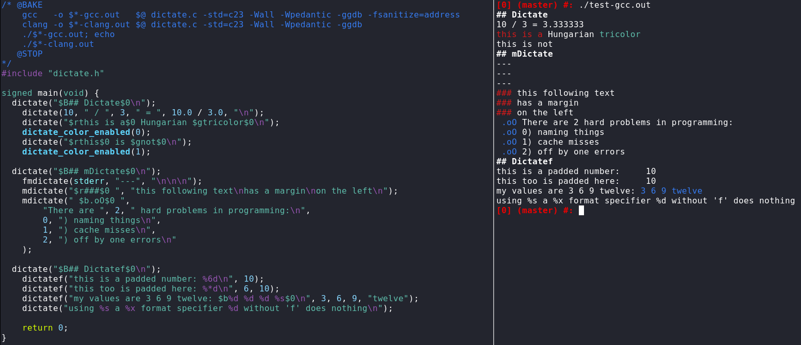

# Dictate
> The Überfunktion of printing. Generics, colors, formats, margins, it has them all.

Dictate is a family of print functions tailored,
but not limited to the cli.

**Dictate**
* is generic,
* is variadic,
* resolves irritating `<stdio.h>` inconsistencies,
* supports C and C++,
* has debug variants,
* has a convenient way to handle colors,
* and adds margin support.

## Example


## Irritating stdio inconsistencies
The sole reason Dictate exists is this:
```C
    fprintf(FILE *, char *, ...); // FILE first
    fputs(char *, FILE *);        // FILE last
```

## Generic and variadic?
Yes, `dictate()` is generic and variadic.
You can pass in as many arguments as you wish and with the types you wish,
without requiring a format string.
Unless, of course, you *want* a format string,
in which case `dictatef()`
-behaving like `printf()`, but with the rest of the Dictate features-
has you covered.
This is accomplished with a combination of C11's `_Generic` and macros.

Supported types out of the box:
* primitive types
* C strings
* C++ iterables

Dictate can also be expanded with user types.
1. `DICTATE_H` has to be defined
2. `dictate.h` has to be included, this will define `DICTATE_PRINTER_COMMON_ARGS` for us
3. a type printer is defined
4. `DICTATE_USER_TYPES` is defined
5. `DICTATE_H` is undefined
6. `dictate.h` is re-included

Example:
```C
// @BAKE gcc -o $*.out $@ dictate.c -Wall -Wpedantic -std=c23
#include <stdio.h>
#define DICTATE_H
#include "dictate.h"
#undef DICTATE_H

struct byte { unsigned char b; };
struct byte byte(unsigned char c) { return (struct byte) { .b = c, }; }

static inline
void dictate_byte(DICTATE_PRINTER_COMMON_ARGS, struct byte b) {
    fprintf(f, "%02X", b.b);
}

#define DICTATE_USER_TYPES , struct byte : dictate_byte

#include "dictate.h"

signed main(void) {
    dictate(
        byte('\0'), " ",
        byte('a'), " ",
        byte((char)255), "\n"
    );
}
```

## Syntax
Dictate is a family of functions,
where the name of any one functions is composed from its properties.
```
    [debug_] <TARGET> [m] dictate [f]

    m      -> use margin (see below)
    f      -> use format string (printf style)
    debug_ -> only print in debug builds (see below)
    TARGET:
        %empty -> stdout
        f      -> FILE *
```
The parameters used across variants are consistent.
The easiest way to understand them is to read this signature:
```
fmdictate(FILE * f, char * margin, ...);
```

## Colors
With Dictate,
instead of passing in ascii escape sequences directly,
you pass in color specifiers of the form: `$<first-letter-of-color>`.
Not only is this easier to remember,
you can also toggle their rendering (per thread),
which makes implementing something like `NO_COLOR` compliance trivial.
```C
$r  -> Red
$g  -> Green
$b  -> Blue
$y  -> Yellow
$m  -> Magenta
$c  -> Cyan
$d  -> black ("dark")
$w  -> white
$B  -> Bold
$I  -> Italic
$0  -> Reset

void dictate_color_enabled(bool b);
```

## Debug builds
Dictate provides `debug_*` variants for its every function.
These are only executed if `DEBUG` was defined,
otherwise they result in nops.

## Margins
Margins are characters which appear on the left of each line of an output.
They are useful for distinguishing regions of output for a reader.
Examples would include *valgrind* or *cmdtest*.
Dictate has function variants which produce such margins.

## Notes
Dictate requires C23.

This manpage was rendered from markdown.

For implementation details / experimental feature documentation,
please consult the [header](source/dictate.h),
it was made to be readable.
