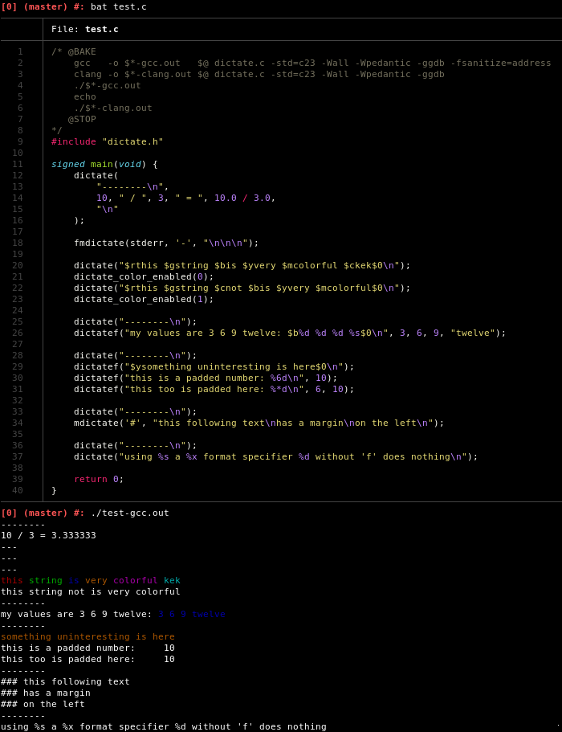

# Dictate
> The Überfunktion of printing. Generics, colors, formats, margins, it has them all.

Dictate is a family of print functions tailored,
but not limited to the cli.

Dictate
- is generic,
- is variadic,
- resolves irritating `<stdio.h>` inconsistencies,
- has debug variants,
- has a convenient way to handle colours,
- and adds margin support.

## Example


## Generic and variadic?
Yes, `dictate()` is generic and variadic.
You can pass in as many arguments as you wish and with the types you wish,
without requiring a format string.
Unless you want a format string,
in which case `dictatef()`
-behaving like `printf()`, but with the rest of the dictate features-
has you covered.
This is accomplished with a combination of C11's `_Generic` and macros.

## Irritating stdio inconsistencies
The sole reason dictate exists is this:
```C
    fprintf(FILE *, char *, ...); // FILE first
    fputs(char *, FILE *);        // FILE last
```

## Colors
With dictate,
instead of passing in ascii escape sequences directly,
you pass in color specifies of the form: `$<first-letter-of-colour>`.
Not only is this easier to remember,
you can also toggle their rendering per thread,
which makes implementing something like `NO_COLOR` compliance trivial.

## Debug builds
Dictate provides `debug_*` variants for its every function.
These are only executed if `DEBUG` was defined,
otherwise they result in nops.

## Margins
Margins are characters which appear on the left of each line of an output.
They are useful for distinguishing regions of output for a reader.
Examples would include `valgrind` or `cmdtest`.
Dictate has function variants which produce such margins.

## Notes
Dictate requires C23.

For the full documentation,
please consult the [header](dictate.h),
it was made to be readable.
